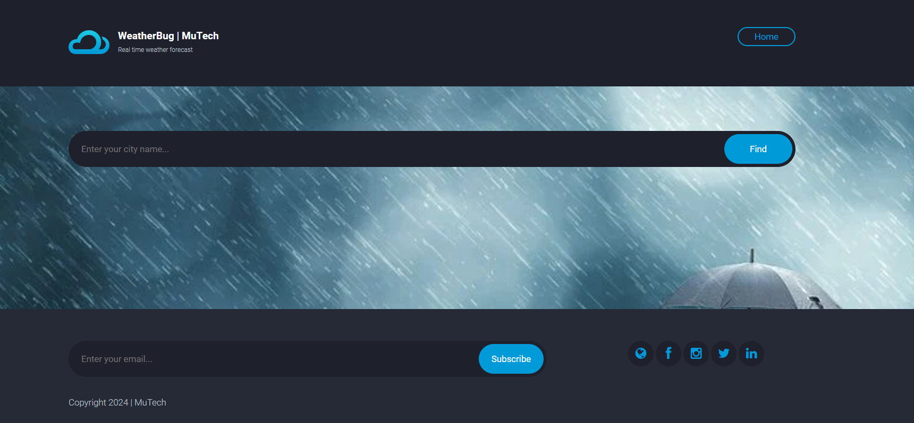
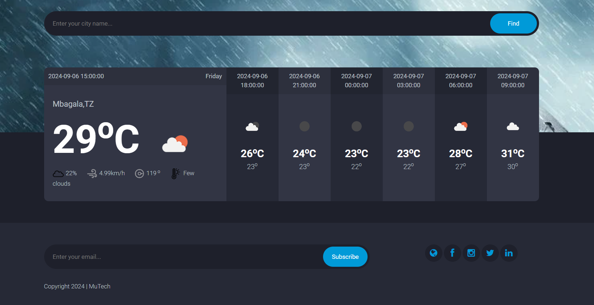

*WeatherBug is the application of science and technology to predict the conditions of the atmosphere for a given location and time. You can get the realtime Weather forecasting by using this web application*

-->

## Requirements
1.  Python 3+
2.  Django 3+

## Setup, Installation and Run

To run the app on your local machine, you need Python 3+, installed on your computer. Follow all the steps to run this project.
   
##  Create `venv` virtual environment:
  pip install venv virtual_env_name
    
##  Activate `venv` virtual environment:
   source virtual_env_name/Scripts/activate

## Then enter the corresponding directory:
   cd Weather_App--Python-Django
   
## Install all the requirements using pip:
   pip install -r requirements.txt

6.	Run server:
   python manage.py runserver

## Tools
## Front-end Part

* HTML
* CSS
* Bootstrap
* JavaScript
## Back-end
* Django
* SQLite 3

# Screenshots of the Project

  
  

